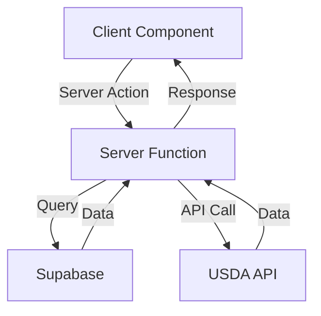
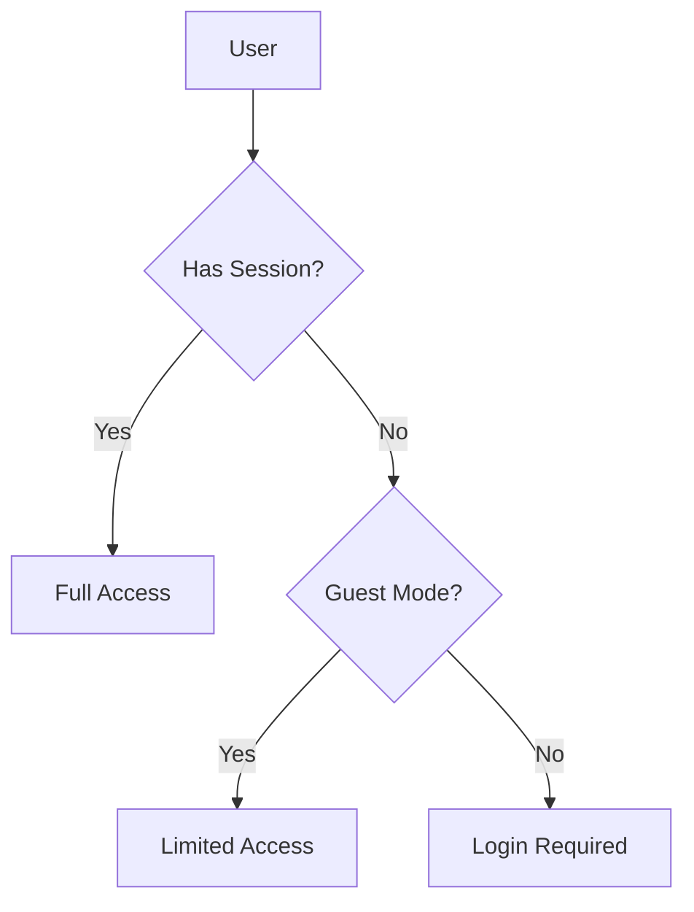

# Architecture Overview

## Next.js 13+ App Router Structure

The application uses Next.js 13's App Router, which provides:

- Server Components by default
- Nested routing with folders
- Server-side data fetching
- Server Actions for form handling

### Directory Structure Explained

```
/app
├── api/                  # API Routes
│   ├── foods/           # Food-related endpoints
│   └── usda-search/     # USDA API integration
├── auth/                # Authentication pages
│   ├── login/          # Login page
│   └── sign-up/        # Sign up page
├── dashboard/          # Main application
├── food-details/       # Food detail pages
└── landing/           # Landing page
```

## Key Components

### Authentication Flow

1. **Landing Page** (`/app/landing/page.tsx`)

   - Entry point for users
   - Options to sign in, create account, or continue as guest
   - Guest mode implementation using sessionStorage

2. **Auth Pages** (`/app/auth/`)

   - Login and signup forms
   - Integration with Supabase Auth
   - Protected route handling

3. **Dashboard** (`/app/dashboard/`)
   - Main application interface
   - Meal tracking functionality
   - Real-time updates using Supabase

### Data Flow



## Authentication & Authorization

### User Authentication

Three authentication states:

1. **Authenticated User**

   - Full access to all features
   - Persistent data storage
   - Real-time updates

2. **Guest User**

   - Limited access (search and view only)
   - Session-based state
   - No data persistence

3. **Unauthenticated User**
   - Access to public routes only
   - Redirect to login

### Implementation Details

```typescript
// Middleware protection
export async function middleware(request: NextRequest) {
  const response = NextResponse.next()
  const supabase = createMiddlewareClient({ req: request, res: response })
  const {
    data: { session },
  } = await supabase.auth.getSession()
  const isGuestMode = request.cookies.get('guestMode')?.value === 'true'

  // Route protection logic
  // ...
}
```

## State Management

### Client-Side State

1. **React Hooks**
   - Custom hooks for common functionality
   - Separation of concerns
   - TypeScript integration

Example custom hook:

```typescript
export function useGuestMode() {
  const [isGuest, setIsGuest] = useState(false)

  useEffect(() => {
    const guestMode = sessionStorage.getItem('guestMode') === 'true'
    setIsGuest(guestMode)
  }, [])

  return { isGuest /* ... */ }
}
```

2. **Server Actions**
   - Form handling
   - Data mutations
   - Error handling

Example server action:

```typescript
'use server'

export async function createMeal(type: MealType, date: string) {
  const supabase = await getAuthenticatedClient()
  // Implementation...
}
```

## Data Layer

### Supabase Integration

1. **Client Setup**

```typescript
const supabase = createClient(supabaseUrl, supabaseKey, {
  auth: {
    persistSession: false,
    autoRefreshToken: false,
  },
})
```

2. **Database Schema**

```sql
create table public.foods (
  id uuid default uuid_generate_v4() primary key,
  name text not null,
  calories_per_serving integer not null,
  -- Additional fields...
);

create table public.meals (
  id uuid default uuid_generate_v4() primary key,
  user_id uuid references auth.users,
  meal_type meal_type_enum not null,
  -- Additional fields...
);
```

3. **Row Level Security**

```sql
alter table foods enable row level security;

create policy "Public foods are viewable by everyone"
  on foods for select
  using (true);

create policy "Authenticated users can create foods"
  on foods for insert
  to authenticated
  with check (true);
```

## UI Component Architecture

### Component Hierarchy

```
<DashboardPage>
├── <GuestBanner /> (conditional)
├── <ExploreFoodsSection>
│   └── <UnifiedFoodSearch />
└── <MealSection> (multiple)
    ├── <MealHeader />
    └── <MealItemCard> (multiple)
```

### Shared Components

Located in `/components/ui/`, built with:

- Radix UI primitives
- Tailwind CSS
- TypeScript props
- ARIA attributes

Example component:

```typescript
interface ButtonProps extends React.ButtonHTMLAttributes<HTMLButtonElement> {
  variant?: 'default' | 'outline' | 'ghost'
  size?: 'default' | 'sm' | 'lg'
}

export function Button({ variant, size, ...props }: ButtonProps) {
  // Implementation...
}
```

## Performance Considerations

1. **Server Components**

   - Reduced JavaScript bundle
   - Faster initial page load
   - SEO benefits

2. **Data Fetching**

   - Server-side data fetching
   - Cached responses
   - Incremental Static Regeneration

3. **Image Optimization**
   - Next.js Image component
   - Automatic optimization
   - Lazy loading

## Error Handling

1. **Client-Side**

   - Toast notifications
   - Form validation
   - Loading states

2. **Server-Side**
   - Error boundaries
   - Status codes
   - Logging

## Testing Strategy

1. **Unit Tests**

   - Component testing
   - Hook testing
   - Utility function testing

2. **Integration Tests**

   - API route testing
   - Authentication flow
   - Database operations

3. **E2E Tests**
   - User flows
   - Critical paths
   - Cross-browser testing

# Architecture Documentation

## Recent Changes

### 1. Guest Mode Enhancement

- Added cookie-based guest mode storage
- Implemented route-based access control
- Updated middleware to handle guest routes
- Added guest mode UI components

### 2. API Access Control

- Moved food search to public access
- Using service role key for consistent database access
- Improved error handling and response formats
- Added proper content-type headers

### 3. Error Handling Improvements

- Standardized error responses
- Added specific error states (401, 503)
- Improved client-side error handling
- Added user-friendly error messages

### 4. Performance Optimizations

- Debounced search queries
- Proper error boundary handling
- Improved loading states

## Updated Architecture Decisions

### Authentication Flow



### API Access Layers

1. **Public Layer**

   - Food search
   - Food details
   - Authentication endpoints

2. **Guest Layer**

   - Dashboard view
   - Basic features

3. **Authenticated Layer**
   - Full functionality
   - Personal data access
